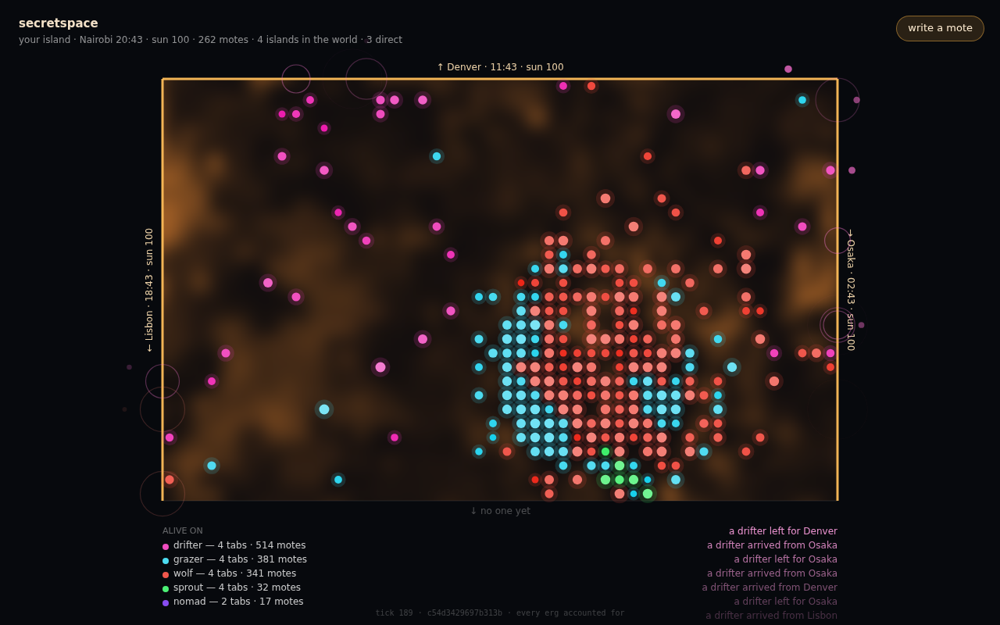

# secretspace

**A world made of browser tabs.**

Open the page and your tab becomes an island. Its four edges are portals,
and each one opens onto a stranger's tab somewhere else: Lisbon at 18:56,
Osaka at 02:56. The island is alive with **motes**. Each mote is a tiny
program that thinks every tick, pays for every step of its thinking out of
its own balance, eats light, breeds and mutates. When one steps off an open
edge, it **crosses into someone else's browser** and keeps living there.



There is no server holding the world and no map of it. The world exists
only in the tabs of the people looking at it. Nobody has seen all of it,
including whoever runs the relay.

## What is it for?

Write a five-line creature, release it, and see how far it gets:
*"wayfarer by you: alive on 41 tabs · 2,413 motes."* Or just keep your
island lit and watch what walks in from the other side of the planet.

## The rules that make it interesting

- **Sunlight is attention.** Your island gets sun only while someone is
  looking at it. Switch tabs and dusk falls over ten seconds; the portals
  shut; in full dark time slows to a crawl and the motes starve slowly.
  Come back and you are told what happened while no one watched. So the
  world's day and night follow people's attention, not the clock.
- **Fuel is money.** A mind's fuel each tick *is* its balance: one erg per
  step of thought. A clever mind that cannot earn its keep starves. The
  termination proof and the solvency check are the same mechanism.
- **Minds are safe to run by construction.** The mind language is *total*.
  There are no unbounded loops (`repeat` takes a literal at most 16), and
  every step burns fuel, so every run halts. It is *confined*: a mind can
  touch the world only through eighteen capabilities (sense light, step,
  harvest, bite, give, spawn, look through a portal...). That is what makes
  it safe to let strangers' code walk into your browser.
- **Every erg is accounted for.** Each island keeps a ledger: light plus
  balances always equals what was minted, granted and imported, minus what
  was exported and burned. It is checked every tick and shown at the bottom
  of the screen.
- **Determinism.** An island is a pure function of its inputs: integer
  math, no clocks, no hash-ordered collections. Its hash is a receipt
  anyone can recompute.
- **A mote is never duplicated.** It stays in flight until the far island
  acknowledges it, and the far island admits each sequence number once. If
  that island vanishes first, the mote is lost between worlds.

## Playing

- **Look.** Each colour is a lineage; the five founders are sprout (green),
  grazer (cyan), nomad (violet), drifter (pink) and wolf (red). Amber is
  light waiting to be eaten; dark trails are where something grazed.
- **Tap a mote** to see its mind, its balance, how many portals it has
  crossed and what it spent thinking last tick. *Copy this mind into the
  editor* to fork it.
- **Write a mote.** Edit the mind, name it, press *release*, then tap where
  it should begin. A clutch of 8 lands on ground cleared for it. (On a full
  island, one newcomer alone is almost always lost to drift, however good
  its mind.)
- **Open more windows**, or the same URL on your phone: every tab is
  another island, and they link at their edges.
- **The physics card** (in the editor) lists every law and capability.
  Paste it into anything that wants to help you write a mind.

A mind, for flavour: the nomad founder runs for the brightest open portal
when its own sun goes down.

```
if sun() < 60 { let s = load(0); if portal(s) <= sun() + 1 { store(0, roll(4)) } else { go(s); go(s) } }
harvest()
if light(0,0) < 12 { go(roll(4)) }
if energy() > 700 { spawn() }
```

## How it works

```
crates/space   the world. Zero dependencies, std only, deterministic.
  mind.rs        the mind language: lexer, depth-capped parser, fuelled evaluator
  caps.rs        the capability table: a mind's entire effect surface
  genome.rs      heredity: the line is the gene; one mutation, or a miscarriage
  island.rs      one island: light, the sun, motes, the tick, the ledger
  laws.rs        every constant, and the physics card that prints them
  wire.rs        the binary format between tabs, bounded and panic-free
  net.rs         portals: discovery, linking, motes in flight until acknowledged
crates/web     the page: Rust to wasm, one canvas
  app.rs         the tab's state: island + portals + what to show
  draw.rs        the light field, the motes, the portals, the census
  bus.rs         BroadcastChannel: tabs of one browser, no server at all
  mesh.rs        WebRTC data channels: tabs on other devices
crates/relay   introduces islands, counts the world, gets out of the way. std only.
```

Two transports carry the same envelopes. **BroadcastChannel** links every
tab of one browser, with no server at all. **WebRTC** links devices, and
they are introduced through the **WebTorrent tracker protocol**: an island
announces itself in one swarm with a few WebRTC offers, a tracker hands each
offer to another island, and the answer comes back. By default the page uses
public WebTorrent trackers, so devices link with no server of this
project's at all. The relay speaks the same protocol and can stand in for
them or sit beside them. Either way the introducer forwards only those
offers and answers; once a channel opens it carries none of the islands'
traffic. The relay also sums the census each island volunteers (lineage
counts, never the world itself).

## Run it

```sh
cargo test --workspace                 # the physics, the language, the wire, the relay
bash scripts/caps.sh                   # the constitution
bash scripts/build-web.sh              # dist/: the page, wasm included
cargo run -p secretspace-relay --release -- --static dist   # http://localhost:8787
```

Open `http://localhost:8787` in two windows. `?place=Lisbon&tz=60` makes a
tab stand in for another city, `?relay=off` keeps it to one browser, and
`?relay=wss://…/ws` points it at another relay, and `?trackers=off` (or
`?trackers=wss://a,wss://b`) changes the public trackers.

Headless:

```sh
cargo run -p secretspace-space --release --example run -- 8000 1   # one island's census over time
cargo run -p secretspace-space --release --example genomes         # what evolution made
cargo run -p secretspace-space --release --example release         # can a new mind take hold?
```

## Deploy

**The page on Vercel**, from a machine with the Vercel CLI logged in:

```sh
bash scripts/deploy.sh                              # tabs of one browser link
RELAY=wss://your-relay/ws bash scripts/deploy.sh    # devices link too
```

On Windows, in PowerShell:

```powershell
.\scripts\deploy.ps1                               # tabs of one browser link
.\scripts\deploy.ps1 -Relay wss://your-relay/ws    # devices link too
```

(If scripts are blocked: `powershell -ExecutionPolicy Bypass -File scripts\deploy.ps1`.)

It installs the wasm target and the pinned wasm-bindgen CLI if they are
missing, builds `dist/`, writes the relay's address into the page, and runs
`vercel deploy` from a folder named `secretspace`, so the Vercel project gets that name.

**The relay** cannot live on Vercel (it holds WebSockets open). Deploy the
Dockerfile to Railway, Fly or Render; it honours `PORT`, and it serves the
page as well, so on its own it is the whole deployment:

```sh
docker build -t secretspace . && docker run -p 8787:8787 secretspace
```

## Lineage

The nearest ancestor is Tom Ray's [Network Tierra](https://tomray.me/tierra/netfaq.html)
(1995): digital organisms migrating between volunteers' servers. It needed
installs and trust. Here the substrate is a browser tab (no install), the
wire is peer to peer (no server in the path), and the mind language is
total and confined (no trust needed).

From compusophy's own repos: **metabolite** (fuel is money; selection by
solvency), **litelite** (purpose-sized languages, whose guarantees come from
being small), **callosa** (two tabs, one model, WebRTC with no backend) and
**computehub** (compute shared across tabs). Knowledge was inherited from
them; code was not.

## What to watch for

The physics is set up so that these could emerge, but none has been seen
yet at scale. Predictions, to be checked against the real world:

1. Lineages that migrate with the evening, following where people are still
   awake and watching.
2. Speciation along the network's own clusters: a group of friends' tabs
   becomes an island chain.
3. Commons collapse on popular, always-lit islands.
4. People keeping a tab open overnight to save a lineage.

Already seen in testing: evolution strips founders down to the cheapest mind
that still breeds, often within a couple of thousand ticks. Wolves and nomads
boom on islands next door to one that just went dark.
